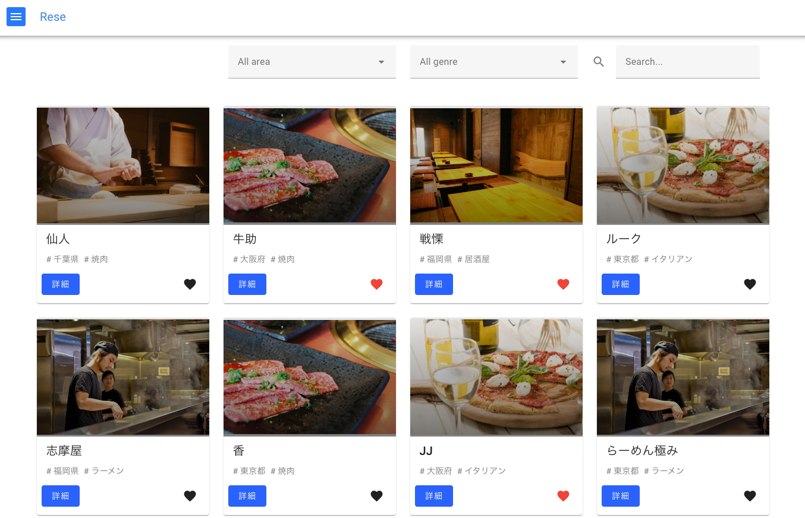

# アプリケーション名

### 飲食店予約管理システム



### サービス名

Rese

### 概要説明

- 一般ユーザー

登録されている飲食店の検索・予約・お気に入り登録・決済を利用するためのアプリケーション

- 店舗代表者ユーザー

店舗の登録・編集・予約確認・お知らせメール送信を利用するためのアプリケーション

- 管理者ユーザー

店舗代表者の作成・編集・お知らせメール送信を利用するためのアプリケーション

## 作成した目的

(Advance ターム)

外部の飲食店予約サービスは手数料を取られるので自社で予約サービスを持ちたい。

[要件定義書](https://docs.google.com/spreadsheets/d/1IF4y5eBm6zgM_64wsPAc_UwLsdiPoZTR2HceWD0icgg/edit#gid=509071084)

## 他のリポジトリ

バックエンドの API の実装を Laravel で行い
フロントエンドの実装は Vue.js で実装する

[Laravel(バックエンド)のリポジトリ](https://github.com/riki-fuku/rese-laravel-app)

## アプリケーション URL デプロイの URL を貼り付る

#### 本番環境(一般ユーザー)

http://rese-vue-app.s3-website-ap-northeast-1.amazonaws.com

| ユーザー名 | メールアドレス | パスワード |
| ---------- | -------------- | ---------- |
| user1      | user1@mail.com | hogehoge   |

#### 本番環境(一般ユーザー)

http://rese-vue-app.s3-website-ap-northeast-1.amazonaws.com/agent/

| ユーザー名 | メールアドレス  | パスワード |
| ---------- | --------------- | ---------- |
| agent1     | agent1@mail.com | hogehoge   |

#### 本番環境(一般ユーザー)

http://rese-vue-app.s3-website-ap-northeast-1.amazonaws.com/admin/

| ユーザー名 | メールアドレス  | パスワード |
| ---------- | --------------- | ---------- |
| admin1     | admin1@mail.com | hogehoge   |

#### 本番環境(メール:MailHog)
http://3.87.3.52:8025/

#### 本番環境(DB)
http://3.87.3.52:8080/

## 機能一覧

- 一般ユーザー

登録されている飲食店の検索・予約・お気に入り登録・決済を利用するためのアプリケーション

| 機能一覧                         |
| -------------------------------- |
| ユーザー登録                     |
| ログイン・ログアウト             |
| 店舗検索                         |
| 店舗予約の確認・変更・削除       |
| 店舗お気に入りの確認・登録・解除 |
| 来店時の QR コード表示           |
| 店舗評価                         |
| 決済                             |

- 店舗代表者ユーザー

| 機能一覧                       |
| ------------------------------ |
| ログイン・ログアウト           |
| 店舗情報の作成・編集           |
| 店舗に対する予約確認           |
| 店舗に対する予約詳細・来店更新 |
| 決済用のの QR コード表示       |
| お知らせメール送信             |

- 管理者ユーザー

| 機能一覧                              |
| ------------------------------------- |
| ログイン・ログアウト                  |
| 店舗代表者の作成・編集・有効化/無効化 |
| お知らせメール送信                    |

## 使用技術(実行環境)

- Vue.js 3
- Node 14.16.1

#### パッケージ

- vue router
- Vuetify
- Pinia
- axios

## 環境構築

以下の手順で環境を構築してください。

1.  Git リポジトリをクローンします。

```
git clone git@github.com:riki-fuku/rese-laravel-app.git
```

2.  必要なツールをインストール

[Vue 環境構築手順](https://github.com/riki-fuku/rese-vue-app/wiki/Vue%E7%92%B0%E5%A2%83%E6%A7%8B%E7%AF%89%E6%89%8B%E9%A0%86)

不要であれば次の手順に進む

3. プロジェクトのルートディレクトリに移動します。

```
cd rese-laravel-app
```

4. .env を必要に応じて、接続情報やその他の設定を変更します。
   本番環境がコメントアウトの状態で、ローカル環境が有効になっていれば問題ない

5. npm でプロジェクトのインストール

```
npm install
```

6.  アプリケーション起動

```
yarn dev
```

以下が表示されていれば成功

```
VITE v3.2.8  ready in 248 ms

➜  Local:   http://localhost:5173/
➜  Network: use --host to expose
```

7. ブラウザで URL にアクセスします。

6 で実行された結果に表示される local の URL にアクセス

```
http://localhost:5173/
```

環境構築が完了したら、Vue アプリケーションを開発する準備が整いました。

画面の表示を行いたい場合は Laravel アプリケーションの起動が必要なため Laravel のリポジトリを確認してください。

[Laravel(バックエンド)のリポジトリ](https://github.com/riki-fuku/rese-laravel-app)

## デプロイ

#### CI/CD

Github Actions

mian ブランチにプッシュされた場合自動で AWS S3 の環境にデプロイされます

## 参考

[福島さん Web 開発上級 生徒様用案件シート Ver.2.0](https://docs.google.com/spreadsheets/d/1IF4y5eBm6zgM_64wsPAc_UwLsdiPoZTR2HceWD0icgg/edit#gid=935968078)
